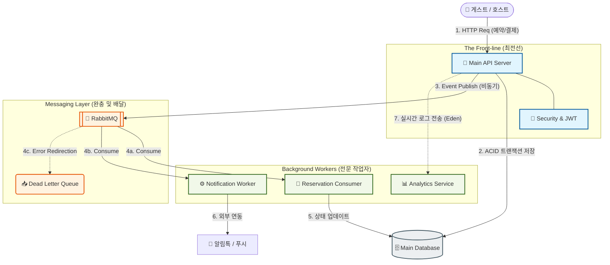

# 🏨 Nextstay (넥스트스테이) - 차세대 숙박 예약 플랫폼 🚀

 **Nextstay** 는 고성능 비동기 처리와 현대적인 MSA 기반 아키텍처를 실무적으로 구현한 숙박 예약 시스템입니다.
 Kotlin(Spring Boot), Bun(Elysia.js), Nuxt 3 등 각 도메인에 최적화된 기술 스택을 활용하여 확장성과 사용자 경험을 극대화했습니다.

---

## 🏗️ 시스템 아키텍처 (Architecture)

Nextstay는  **'최전선 서버의 부하 분산'**  과  **'비동기 데이터 처리'**  를 핵심 설계 원칙으로 합니다.




---

## 🛠️ 기술 스택 (Tech Stack)

### **Backend**
- **Core API**: Kotlin 1.9+, Spring Boot 3.2+
- **Analytics Service**: Bun + Elysia.js (Type-safe E2E with Eden)
- **Messaging**: RabbitMQ (Asynchronous Event Processing)
- **Database**: MySQL 8.0 (Main), SQLite with WAL mode (Analytics)
- **Security**: Spring Security + JWT (Refresh Token SSR Handling)

### **Frontend**
- **Guest Web**: Nuxt 3 (SSR/CSR Hybrid)
- **Admin App**: Vue 3 + Pinia (SPA)
- **Styles**: Vanilla CSS / Tailwind CSS (Optional)

### **Infrastructure**
- **Container**: Docker & Docker Compose
- **Caching**: AWS CloudFront (Full Page Caching for SSR)
- **Storage**: AWS S3 (Presigned-URL Image Upload)

---

## ✨ 핵심 기능 (Key Features)

1.  **비동기 예약 시스템**  : RabbitMQ를 통한 예약 트랜잭션 분리로 대규모 트래픽 응답 지연 해소.
2.  **실시간 유저 분석**  : Bun/Elysia 기반의 초고속 로그 수집 서버와 SQLite WAL 모드를 통한 논블로킹 로깅.
3.  **SSR 최적화**  : CloudFront를 활용한 엣지 캐싱 전략으로 SSR 서버 CPU 부하 90% 이상 절감.
4.  **E2E 타입 안전성**  : Eden Treaty를 통해 백엔드(Elysia)와 프론트엔드(Nuxt) 간 DTO 공유 및 타입 체크.
5.  **보안 강화**  : SSR 환경에서의 Refresh Token 동기화 및 API Rate Limiting 적용.


---

## 📂 프로젝트 구조 (Directory Structure)

```text
Nextstay/
├── backend/            # Kotlin/Spring Boot 메인 API
├── backend-analytics/  # Bun/Elysia 분석 마이크로서비스
├── frontend-guest/     # Nuxt 3 B2C 웹 애플리케이션
├── frontend-backoffice/# Vue 3 B2B 어드민 페이지
├── docs/               # 설계 문서, API 명세, 아키텍처 다이어그램
└── python/             # 개발 편의용 통합 스타터 스크립트
```

---

## 🚀 시작하기 (Getting Started)

프로젝트 루트에서 제공되는 파이썬 스크립트를 사용하여 각 서비스를 간편하게 구동할 수 있습니다.

```bash
# 1. 전체 시스템 통합 시작 (Backend + Frontend)
python python/run.py

# 2. 분석 서비스 전용 시작 (Bun + Elysia + SQLite)
python python/run_analytics.py
```

---

## 📄 문서 라이브러리 (Documentation)
- [시스템 아키텍처 상세](docs/flow/architecture_rabbitmq.md)
- [SSR 캐싱 전략](docs/decisions/03_ssr_caching_strategy.md)
- [API 엔드포인트 명세](docs/plan/api_endpoints.md)
- [통합 테스트 시나리오](docs/test/analytics_test_scenario.md)
