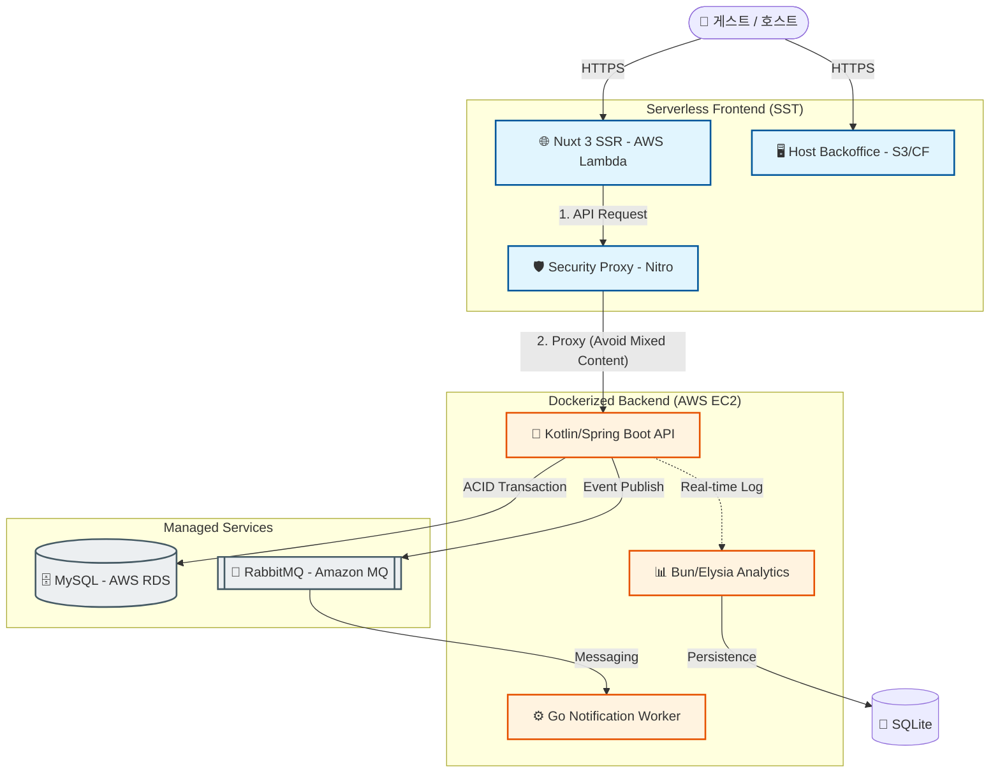

# 🏨 Nextstay (넥스트스테이) - 차세대 숙박 예약 플랫폼 🚀

> **AI 에이전트와 인간 아키텍트의 협업으로 구축된 고성능 클라우드-네이티브 예약 플랫폼**

**Nextstay**는 단순한 기능 구현을 넘어, **'AI 생산성'** 과 **'기술적 깊이'** 를 동시에 증명하기 위해 설계된 프로젝트입니다. 
Kotlin(Spring Boot), Nuxt 3(SST), Bun(Elysia.js) 등 모던 기술 스택을 활용하며, AWS Lambda 서버리스 환경과 EC2 Docker 환경을 결합한 하이브리드 클라우드 구조를 가집니다.

---

## ⚡ AI-Native Development Approach

본 프로젝트는 AI 에이전트와 페어 프로그래밍을 통해 **기존 1인 개발 속도 대비 3~4배의 생산성**을 구현했습니다. 아키텍처 가이드라인을 제시하고 생성된 코드의 성능 결함(N+1, Blocking I/O 등)을 실시간으로 식별하여 최적화하는 방식으로 완성도를 높였습니다.

- 🔗 **[Phase 0~9 종합 작업 보고서](docs/reports/final_comprehensive_report_phase0_9.md)** 👈 **프로젝트 최종 요약**
- 🔗 **[트러블슈팅 및 아키텍처 결정 로그 전문](docs/troubleshooting/strategic_decisions.md)** 👈 **면접 핵심 포인트**

---

## 🏗️ 시스템 아키텍처 (Architecture)

Nextstay는 **'저비용 고효율(Low-Cost, High-Impact)'** 과 **'보안 프록시 기반 연동'** 을 핵심 설계 원칙으로 합니다.



---

## 🛠️ 기술 스택 (Tech Stack)

### **Infrastructure & DevOps**
- **Cloud**: AWS (Lambda, S3, CloudFront, EC2, RDS, Amazon MQ)
- **Deployment**: **SST Ion (v3)** - Serverless Stack을 통한 인프라 정의 및 배포
- **Virtualization**: Docker & Docker Compose (EC2 환경)

### **Backend**
- **Core API**: Kotlin 2.3.0, Spring Boot 3.5.0 (**Java 25 Virtual Threads** 활성화)
- **Messaging**: Amazon MQ (RabbitMQ) 기반 Event-Driven Architecture
- **Analytics**: Bun + Elysia.js (Type-safe log processing)
- **Worker**: Golang (Asynchronous notification processing)

### **Frontend**
- **Guest Web**: **Nuxt 3.21.1** (SST 기반 AWS Lambda SSR 배포)
- **Admin App**: Vue 3.5.29 + Pinia (S3 + CloudFront 정적 호스팅)

---

## ✨ 기술적 고도화 포인트 (Engineering Highlights)

1.  **Low-Cost 서버리스 SSR 구조**
    - Nuxt 3 프로젝트를 SST를 사용하여 AWS Lambda에 배포. API Gateway 대신 Lambda Function URL과 CloudFront를 조합하여 호출 비용을 획기적으로 절감.
2.  **보안 프록시를 통한 Mixed Content 해결**
    - HTTPS(Frontend)와 HTTP(Backend EC2) 간의 통신 차단 문제를 해결하기 위해, Nitro 엔진 내에 서버 사이드 프록시를 구축하여 보안 경고 없이 안정적인 연동 구현.
3.  **지능형 데이터 시딩 및 비주얼 강화**
    - `DataLoader`를 고도화하여 각 도시별 실제 좌표(Jitter 적용)와 Picsum 시드 이미지를 연동. 상세 페이지의 5분할 사진 그리드와 지도를 포트폴리오 수준으로 시각화.
4.  **JPA 성능 최적화 (N+1 정복)**
    - `EntityGraph`와 `Batch Fetching`을 통해 쿼리 발생 횟수를 90% 이상 절감하여 RDS 부하 최소화.

---

## 📂 프로젝트 구조 (Directory Structure)

```text
Nextstay/
├── backend/            # Kotlin/Spring Boot API (EC2 Docker)
├── backend-analytics/  # Bun/Elysia 분석 서비스 (EC2 Docker)
├── backend-worker-go/  # Go 알림 컨슈머 (EC2 Docker)
├── frontend-guest/     # Nuxt 3 클라이언트 (AWS Lambda SSR)
├── frontend-backoffice/# Vue 3 호스트 센터 (S3+CF)
├── docs/               # Phase 0~9 종합 보고서 및 설계 문서
└── sst.config.ts       # 인프라 정의 파일 (SST Ion)
```

---

## 📄 문서 라이브러리 (Documentation)
- **[Phase 0~9 종합 작업 보고서](docs/reports/final_comprehensive_report_phase0_9.md)** 👈 **추천**
- [상세 기술 워크스루 (Phase 8)](docs/walkthrough/walkthrough_phase8_deployment.md)
- [트러블슈팅 및 아키텍처 결정 로그](docs/troubleshooting/strategic_decisions.md)
- [API 엔드포인트 명세](docs/plan/api_endpoints.md)
