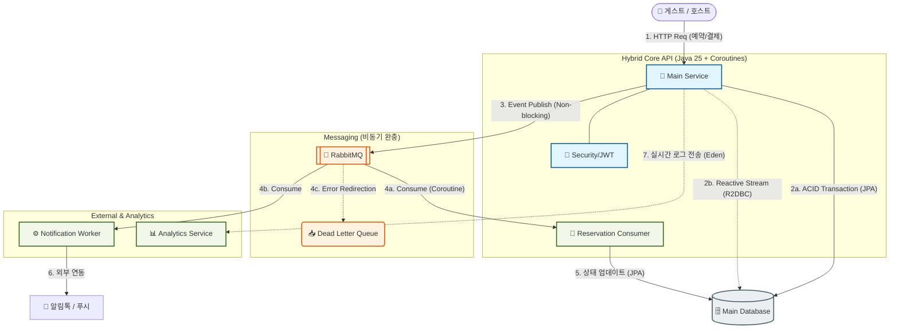

# 🏨 Nextstay (넥스트스테이) - 차세대 숙박 예약 플랫폼 🚀

> **AI 에이전트와 인간 아키텍트의 협업으로 구축된 고성능 비동기 예약 플랫폼**

**Nextstay**는 단순한 기능 구현을 넘어, **'AI 생산성'** 과 **'기술적 깊이'** 를 동시에 증명하기 위해 설계된 프로젝트입니다. 
Kotlin(Spring Boot), Bun(Elysia.js), Nuxt 3 등 모던 기술 스택을 활용하며, 특히 **Java 21 가상 스레드(Virtual Threads)** 와 **Kotlin Coroutines** 를 결합한 비동기 아키텍처의 정수를 담고 있습니다.

---

## ⚡ AI-Native Development Approach

본 프로젝트는 AI 에이전트와 페어 프로그래밍을 통해 **기존 1인 개발 속도 대비 3~4배의 생산성**을 구현했습니다. 단순 코드 생성이 아닌, 아키텍처 가이드라인을 제시하고 생성된 코드의 성능 결험(N+1, Blocking I/O 등)을 실시간으로 식별하여 최적화하는 방식으로 완성도를 높였습니다.

- 🔗 **[트러블슈팅 및 아키텍처 결정 로그 전문](docs/troubleshooting/strategic_decisions.md)** 👈 **면접 핵심 포인트**

---

## 🏗️ 시스템 아키텍처 (Architecture)

Nextstay는  **'이벤트 기반 비동기 처리'** 와 **'데이터베이스 부하 최소화'** 를 핵심 설계 원칙으로 합니다.



---

## 🛠️ 기술 스택 (Tech Stack)

### **Backend**
- **Core API**: Kotlin 2.3.0, Spring Boot 3.5.0 (**Java 25 Virtual Threads** 활성화)
- **Async Engine**: Kotlin Coroutines (Non-blocking I/O)
- **Database**: MySQL 8.0 (JPA/Hibernate 최적화), **R2DBC (POC 진행)**
- **Messaging**: RabbitMQ (Event-Driven Architecture)
- **Analytics**: Bun + Elysia.js (Type-safe log processing)

### **Frontend**
- **Guest Web**: Nuxt 3.21.1 (SSR/CSR Hybrid)
- **Admin App**: Vue 3.5.29 + Pinia (Composition API)

---

## ✨ 기술적 고도화 포인트 (Engineering Highlights)

1.  **JPA 성능 끝판왕 (N+1 정복)**
    - 숙소 및 예약 목록 조회 시 발생하는 **1+3N 문제**를 `EntityGraph`와 `default_batch_fetch_size: 100` 설정을 조합하여 쿼리 발생 횟수를 **90% 이상 절감**.
2.  **완벽한 비동기 파이프라인**
    - `Thread.sleep` 등 블로킹 코드를 배제하고 `suspend delay`와 `Dispatchers.IO`를 사용하여 메시지 발행/소비 과정에서 스레드 효율을 극대화.
3.  **Hybrid Web Engine**
    - Spring MVC의 안정성 위에서 WebFlux/R2DBC를 부분적으로 도입하여, 특정 고부하 모듈(조회용)의 성능을 Node.js 수준으로 끌어올리는 하이브리드 아키텍처 구현.
4.  **JWT Dynamic State Sync**
    - 유저 권한 및 온보딩 상태 변경 시 별도의 로그아웃 없이 서버 사이드에서 새로운 토큰을 발급하여 프론트엔드 상태를 즉시 동기화.

---

## 📂 프로젝트 구조 (Directory Structure)

```text
Nextstay/
├── backend/            # Kotlin/Spring Boot 메인 API (JPA & Coroutines)
├── backend-analytics/  # Bun/Elysia 분석 마이크로서비스
├── frontend-guest/     # Nuxt 3 B2C 웹 애플리케이션 (SSR)
├── docs/               # 설계 문서 및 트러블슈팅 로그 (Interview-ready)
├── python/             # 개발 편의용 통합 스타터 엔진 (Virtual Thread 호환)
└── docker-compose.yml  # 인프라 원터치 구축
```

---

## 🚀 시작하기 (Getting Started)

프로젝트 루트에서 제공되는 파이썬 스크립트를 사용하여 각 서비스를 간편하게 구동할 수 있습니다.

```bash
# 1. 전체 시스템 통합 시작 (Backend + Frontend)
python python/run.py

# 2. 분석 서비스 전용 시작 (Bun + Elysia + SQLite)
python python/run_analytics.py
```

---

## 📄 문서 라이브러리 (Documentation)
- **[트러블슈팅 및 아키텍처 결정 로그](docs/troubleshooting/strategic_decisions.md)** 👈 **추천**
- [JPA 성능 최적화 가이드](docs/plans/phase3_jpa_optimization.md)
- [WebFlux & R2DBC 도입 전략](docs/plans/phase2_webflux_poc.md)
- [비동기 아키텍처 상세 설계](docs/plans/phase1_async_architecture.md)
- [API 엔드포인트 명세](docs/plan/api_endpoints.md)
