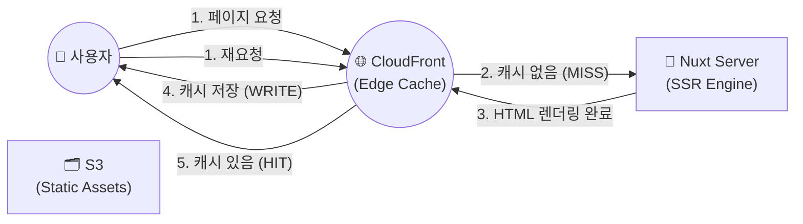

# 🚀 Nextstay SSR 부하 절감 및 캐싱 전략 (CloudFront 활용)

SSR은 CSR과 달리 매 요청마다 서버가 HTML을 렌더링하므로 CPU/메모리 부하가 큽니다. 이를 해결하기 위해 **'렌더링 결과(HTML)를 엣지(Edge)에서 캐싱'**하는 전략이 핵심입니다.

## 1. 🏗️ 전체 구조 (Architecture Visualization)



## 2. 🛠️ 핵심 구현 방안

### ① Cache-Control 헤더의 활용 (The Contract)
Nuxt 서버가 응답을 보낼 때, CloudFront(브라우저 아님!)에게 이 페이지를 얼마나 오래 가지고 있어도 되는지 알려줘야 합니다.

*   **Public Cache (CloudFront 전용)**:
    ```http
    Cache-Control: public, s-maxage=60, stale-while-revalidate=30
    ```
    *   `s-maxage=60`: CloudFront(Shared Cache)에서 **60초 동안만** 이 HTML을 보관하라는 의미입니다.
    *   `stale-while-revalidate=30`: 캐시가 만료된 후 30초 동안은 일단 이전 캐시를 보여주되, 백그라운드에서 새 페이지를 렌더링하라는 의미입니다. (Zero-downtime 렌더링)

### ② 개인화 정보의 분리 (Decoupling Personalization)
모든 유저에게 동일하게 보이는 HTML만 캐싱해야 합니다. 유저 정보(이름, 장바구니 등)는 HTML에 포함하지 않고 다음과 같이 처리합니다.

1.  **Skeleton Rendering**: 서버는 공통된 UI(껍데기)만 렌더링해서 보냅니다. (이 HTML은 CloudFront에서 캐싱 가능!)
2.  **Client-side Fetching**: 로그인한 유저의 이름이나 찜 목록은 브라우저에서 `onMounted` 시점에 API 서버로 다시 요청해서 가져옵니다.

### ③ 캐시 무효화 (Cache Invalidation)
숙소 가격이 바뀌거나 정보가 수정되었을 때, CloudFront에 저장된 낡은 캐시를 지워야 합니다.

*   **방법 A (수동)**: AWS CLI나 Console에서 특정 경로(`/accommodations/123`)를 무효화(Invalidate)합니다.
*   **방법 B (자동/전략적)**: 숙소 정보 수정 API가 호출될 때, 백엔드 서버가 CloudFront API를 호출하여 해당 페이지의 캐시를 삭제합니다.

## 3. 🎯 Nextstay 서비스별 캐싱 전략

| 페이지 타입 | 캐싱 여부 | 전략 |
| :--- | :--- | :--- |
| **메인 / 숙소 목록** | **YES** | `s-maxage=60` (1분 캐싱). 트래픽이 몰려도 서버는 1분에 1번만 일하면 됨. |
| **숙소 상세** | **YES** | `s-maxage=300` (5분 캐싱). 이미지와 텍스트 위주이므로 공격적으로 캐싱 가능. |
| **예약 상세 / 마이페이지** | **NO** | `Cache-Control: no-store`. 개인 정보가 담겨있으므로 절대 캐싱하지 않음. |
| **JS / CSS / 이미지** | **YES** | `max-age=31536000` (1년 캐싱). S3에 위치하며 빌드 해시가 바뀌지 않는 한 영구 캐싱. |

## 4. 💡 도입 시 얻는 이득 (Strategic Benefits)

1.  **서버 비용 절감**: 초당 1,000명의 유저가 들어와도 실제 서버는 1분에 1번(캐시 갱신 시점)만 일하면 되므로, 저사양 서버로도 운영이 가능합니다.
2.  **SEO 최우수 등급**: 구글 로봇에게 항상 렌더링이 완료된 HTML을 빛의 속도(Edge 전송)로 줌으로써 검색 순위 상위권을 점유할 수 있습니다.
3.  **장애 격리**: 메인 서버가 잠시 점검 중이거나 장애가 나도, CloudFront에 저장된 캐시 덕분에 유저는 최소한 숙소 조회는 계속할 수 있습니다. (Static fallback)
