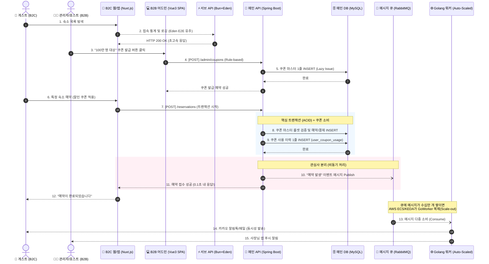

# 🔄 넥스트스테이(Nextstay) 런타임 & 데이터 흐름도

이 문서는 시스템이 실제로 어떻게 동작하고, 데이터가 어떻게 흘러가는지를 시각적으로 보여주는 아키텍처 다이어그램입니다.
MSA, 비동기 큐, 그리고 대용량 트래픽 통제(Auto-scaling, Lazy Issue)를 고려한 최종 설계가 반영되어 있습니다.

---

## 1. 🚀 전체 시스템 구조 및 실행 흐름도 (Execution Flow)
고객(B2C)과 관리자(B2B)가 각각의 프론트엔드로 접속하여 시스템과 상호작용하는 흐름입니다. 특히 결제 시 **쿠폰 지연 발급(Lazy Issue)** 및 **Golang 워커의 비동기 처리**가 강조됩니다.



**[실행 흐름 핵심 포인트]**
* **지연 발급(Lazy Issue) 방어**: 관리자가 100만 명에게 쿠폰을 쏴도 DB에는 5번에서 **마스터 1줄**만 들어갑니다. 유저가 실제 결제를 하는 8, 9번 시점에만 사용 이력이 INSERT되어 **최악의 DB 병목을 차단**합니다.
* **비동기 격리 (RabbitMQ)**: 메인 서버(Spring)는 10번에서 큐에 메시지만 쏘고 11번에서 유저에게 즉시 성공을 반환합니다.
* **Golang Auto-Scaling**: 알림톡 100만 개를 쏴야 할 때, MQ의 큐 길이(Queue Depth)를 감지하여 KEDA/AWS ECS가 **Golang 워커를 무한 복제**하여 고루틴의 압도적 성능으로 큐를 빠르게 비웁니다.

---

## 2. 🗂️ 데이터 흐름도 (Data Flow Diagram)
전체 시스템 아키텍처 수준에서 대용량 트래픽 최적화(CDN)와 자동화 배포 파이프라인(CI/CD)이 포함된 최종 아키텍처 지도(Map)입니다.

```mermaid
graph TD
    %% CI/CD 파이프라인 (자동화)
    subgraph "CI/CD Pipeline (GitHub Actions)"
        Git["🐙 GitHub Repository"]
        Build["⚙️ Build & Test<br>비동기 병렬 빌드"]
        Deploy["🛥️ 롤링/무중단 배포<br>AWS ECR & ECS"]
        
        Git -->|Push/Merge| Build
        Build -->|Image Push| Deploy
    end

    %% 프론트엔드 영역 (+ CDN 최적화)
    subgraph "Frontend & Edge Edge Network"
        CDN(("🌐 AWS CloudFront<br>CDN 캐싱"))
        S3["🗂️ AWS S3<br>숙소 고화질 이미지 보관"]
        B2C["📱 게스트 Web/App<br>Vue 3 Nuxt.js SSR + Tailwind CSS"]
        B2B["💻 관리자/호스트 어드민<br>Vue 3 SPA + Tailwind CSS"]
        
        CDN --- S3
        CDN --- B2C
    end

    %% 내부 백엔드 서비스
    subgraph "Backend Services (MSA)"
        Spring["🌱 메인 API 서버<br>Kotlin + Spring Boot"]
        Elysia["⚡ 서브/통계 API<br>Bun + Elysia.js"]
        GoWorker["⚙️ 알림/배치 워커<br>Golang + AWS ECS(Auto-Scaled)"]
    end

    %% 데이터 & 인프라
    subgraph "Data & Messaging Layer"
        MySQL[("🗄️ 메인 RDBMS<br>AWS RDS")]
        RabbitMQ[["🐰 Message Queue<br>RabbitMQ"]]
        ELK[("📊 통합 로그/ML 파이프라인<br>ELK Stack")]
    end

    %% 통신 흐름 (User -> Edge -> Server)
    User(("👤 사용자")) -->|1. 정적 에셋/캐시 요청| CDN
    User -->|2. 동적 API 요청 (REST)| B2C
    
    B2C <-->|"3. 예약/결제 (REST)"| Spring
    B2C -.->|"4. 로그 (Eden E2E Type Safe)"| Elysia
    B2B <-->|"5. 정산/CS & 룰 생성"| Spring
    
    Spring <-->|"6. ACID 트랜잭션 (Lazy Coupon)"| MySQL
    Spring -->|"7. 분산 트랜잭션 이벤트"| RabbitMQ
    
    RabbitMQ -->|"8. 동시성 Consume"| GoWorker
    GoWorker -.->|"9. 카카오/SMTP API"| External["외부 알림 서버"]
    
    %% 로그 및 빅데이터 (Next Step AI/ML)
    Spring -.->|"10. 비즈니스 로그"| ELK
    Elysia -.->|"11. 통계 로깅"| ELK
    ELK -.->|"12. ML/DL 인사이트 피드백"| B2B
    
    %% 배포 연결선
    Deploy -.->|"컨테이너 업데이트"| Spring
    Deploy -.->|"컨테이너 업데이트"| Elysia
    Deploy -.->|"컨테이너 업데이트"| GoWorker

    classDef client fill:#f9f,stroke:#333,stroke-width:2px;
    classDef edge fill:#e0f7fa,stroke:#00acc1,stroke-width:2px;
    classDef mainBackend fill:#d4edda,stroke:#28a745,stroke-width:2px;
    classDef subBackend fill:#fff3cd,stroke:#ffc107,stroke-width:2px;
    classDef worker fill:#e2e3e5,stroke:#6c757d,stroke-width:2px;
    classDef db fill:#cce5ff,stroke:#007bff,stroke-width:2px;
    classDef mq fill:#f8d7da,stroke:#dc3545,stroke-width:2px;
    classDef cicd fill:#f5f5f5,stroke:#9e9e9e,stroke-width:2px,stroke-dasharray: 5 5;
    
    class B2C,B2B client;
    class CDN,S3 edge;
    class Spring mainBackend;
    class Elysia subBackend;
    class GoWorker worker;
    class MySQL,ELK db;
    class RabbitMQ mq;
    class Git,Build,Deploy cicd;
```

**[심화 아키텍처 설계 의도 (Next Level)]**
1. **Edge Network (CDN & S3) 병목 차단**: 
   * 호텔/숙박 도메인의 특성상 고화질 방 사진 뷰어 트래픽이 엄청납니다. 이를 메인 서버(EC2)가 내어주면 아웃바운드 대역폭 요금 폭탄과 느린 로딩을 유발하므로, **AWS CloudFront(CDN)와 S3를 연결하여 Edge 단에서 이미지를 캐싱 서빙**합니다.
2. **프론트엔드 생산성 향상 (Tailwind CSS)**: 
   * B2C(Nuxt.js)와 B2B(Vue) 양쪽에서 유틸리티 우선의 Tailwind CSS를 채택하여, 컴포넌트 간 스타일 충돌을 없애고 배포 시 렌더링 최적화(Purge CSS)를 달성합니다.
3. **CI/CD 파이프라인 자동화 (GitHub Actions)**: 
   * MSA 구조에서는 서버가 3개나 존재하므로 수동 배포가 불가능합니다. 코드 병합 시 **GitHub Actions**가 병렬 빌드를 수행하고, 도커 이미지를 구워 AWS ECS 클러스터에 **무중단 배포(Zero-downtime)**를 실행하는 현대적인 데브옵스 흐름을 완성했습니다.
