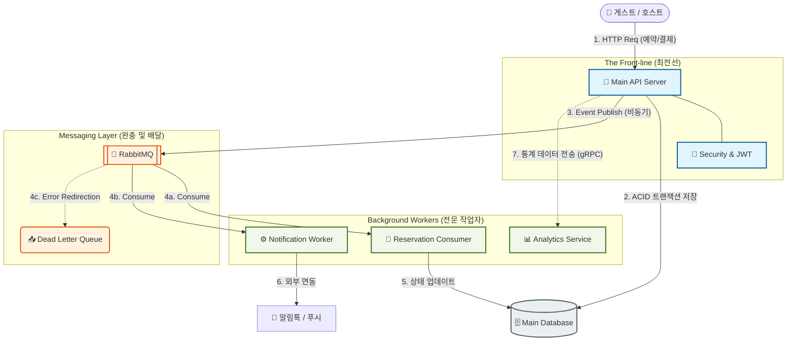

# 🐰 RabbitMQ 중심 비동기 아키텍처 구조도

이 문서는 Nextstay 프로젝트의 ** 최전선(Main API)과 RabbitMQ를 활용한 비동기 처리 흐름 ** 을 시각화한 문서입니다.

## 🏗️ 전체 시스템 구조

---

## 🔍 기술적 핵심 개념

### 1. 최전선 (The Front-line)
- **역할**: 모든 사용자 요청의 진입점입니다.
- **특징**: 보안 검증(JWT) 및 핵심 트랜잭션(DB 저장)만 즉시 처리하고, 시간이 오래 걸리는 작업은 RabbitMQ로 위임하여 **사용자 응답 속도를 극대화**합니다.

### 2. 완충 지대 (Messaging Layer)
- **RabbitMQ**: 시스템 간의 결합도를 낮추는 버퍼 역할을 합니다. 트래픽이 몰려도 메시지를 안전하게 보관하여 후속 워커들이 순차적으로 처리하게 돕습니다.
- **DLQ (Dead Letter Queue)**: 처리에 실패한 메시지를 별도로 격리하여 데이터 유실 없이 사후 분석 및 재처리가 가능하게 합니다.

### 3. 전문 작업자 (Background Workers)
- **분업화**: 각 작업의 성격에 맞는 기술 스택(Kotlin, Golang, Bun)을 사용하여 시스템 전체의 효율성과 확장성(Scalability)을 높였습니다.
